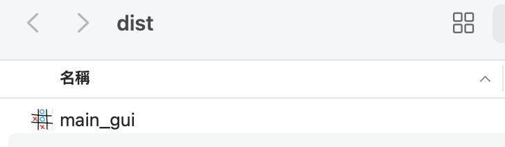

# TicTacToeGame
Complete Game Development Design

#### workflow
1. design class
2. computer training by self
3. write pyqt6
4. write flask
5. write html
6. write dockerfile
7. write aws_ecr.sh
8. sh aws_ecr.sh
9. use ec2 docker pull ecr image
10. run docker service
11. open security inbound and outbound
12. into url page

#### package gui 
* Python-version:3.8.10
* pip install -r requirements.txt
* python main_gui.py
* Reinforcement Learning (RL) Training: Train the model for 20 million iterations.
* GUI Layout with PyQt5: Apply PyQt5 to design the graphical user interface (GUI).
* create package with .exe: pyinstaller --onefile --add-data "./q_table.pkl:." --icon=./photo/icon.icns --windowed main_gui.py

---
##### file_location: dist/main_gui

##### init

##### start

##### tie

##### ai_win

##### human_win

